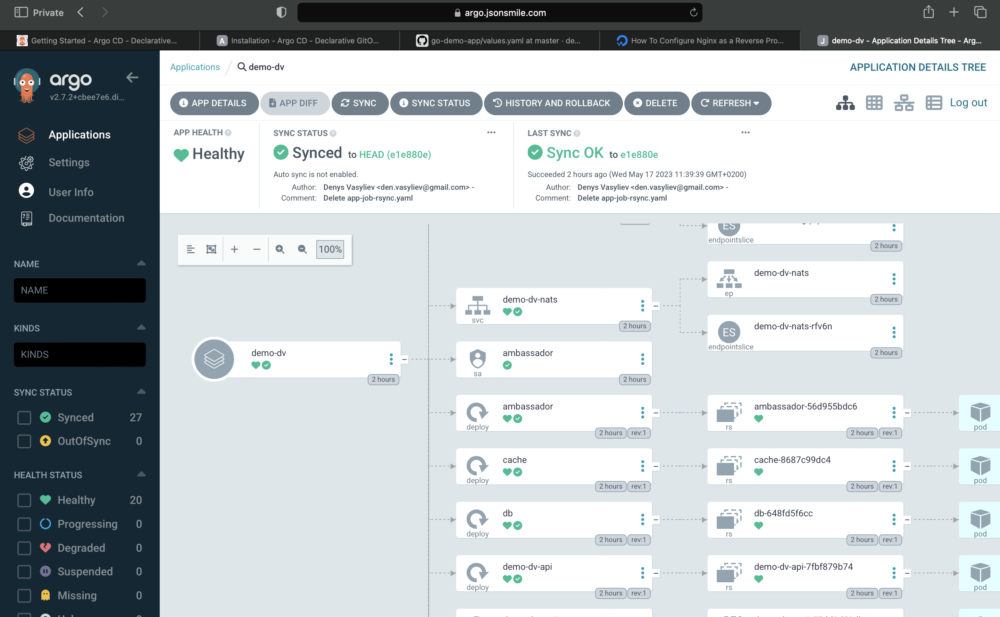

After successfully configuring ArgoCD, you can see a full cycle how ArgoCD automatically tracks and synchronizes changes from the Git repository and deploys them to the Kubernetes cluster.

The task's outcome has a short demo in the project repository showcasing how application works when deploying.

## Demo

You can find a video demonstration of the project deployment and synchronization process [here](../demo/argogif.gif).

Here's a screenshot of the deployed project:

